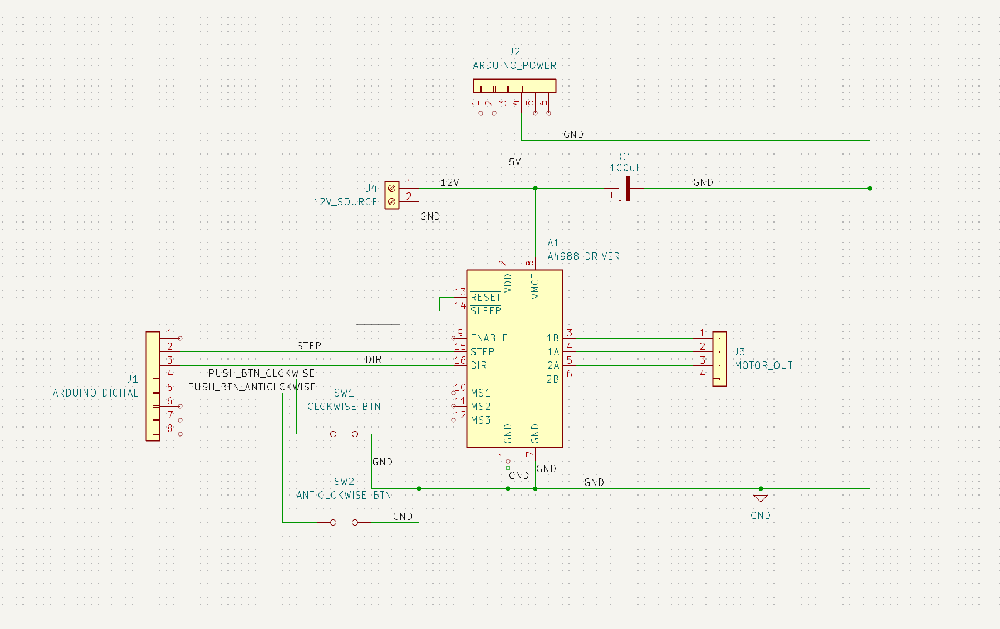
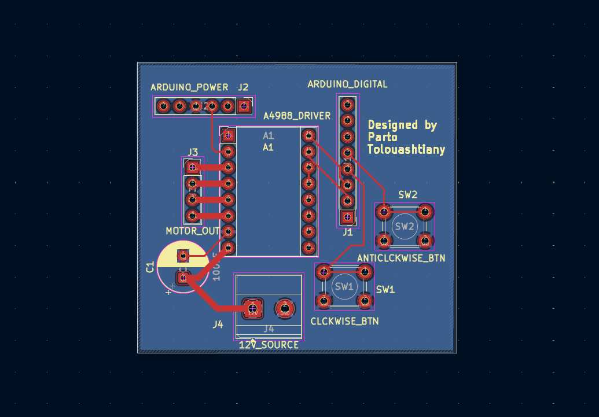
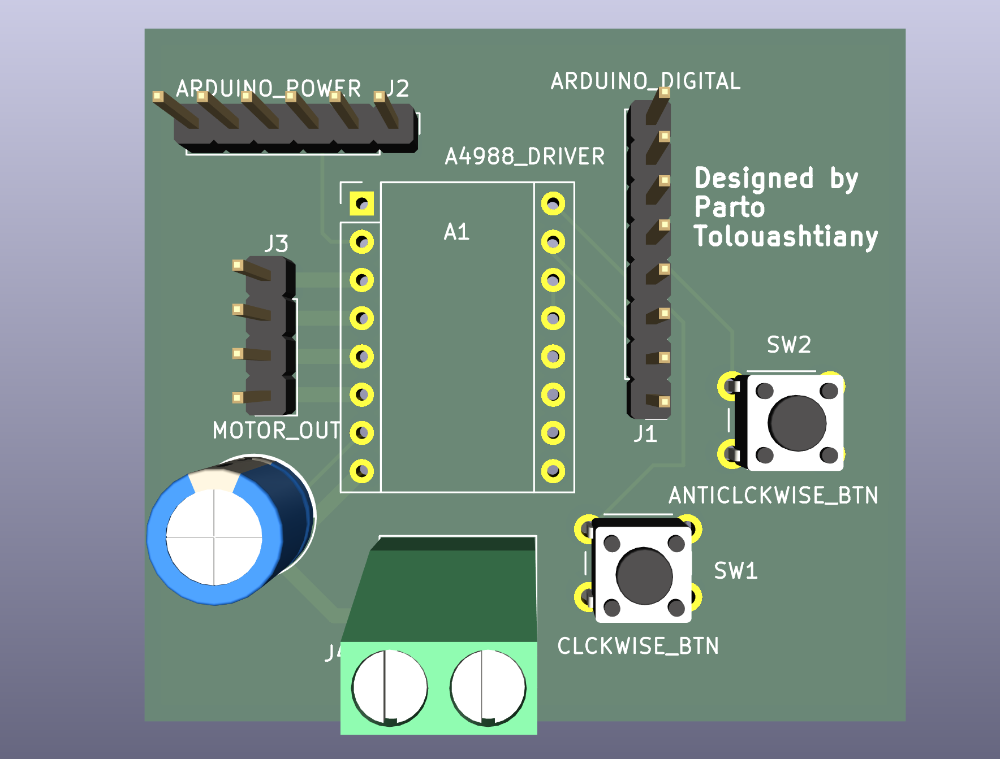

# stepper-motor-controller-pcb

## Overview

Designed a custom PCB in KiCad to control a NEMA-17
stepper motor through an A4988 driver.

The design includes:

- Arduino Uno headers
- A4988 driver interface
- Push-button inputs
- Status LEDs
- Power filtering capacitor
- Motor output connections

## Tools

- KiCad
- Arduino Uno
- A4988 Stepper Driver

## Features

- Controls NEMA-17 stepper motor
- Button-based user interface
- Modular driver design
- Custom PCB layout

## Schematic

## PCB Layout

## 3D Render

